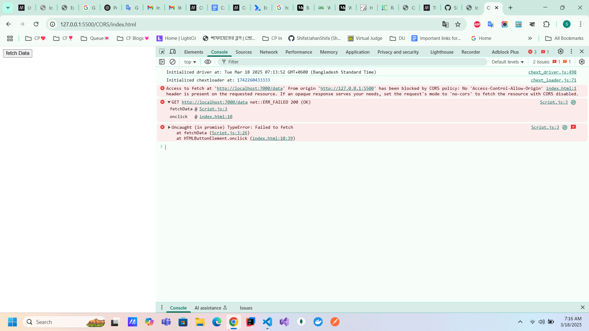
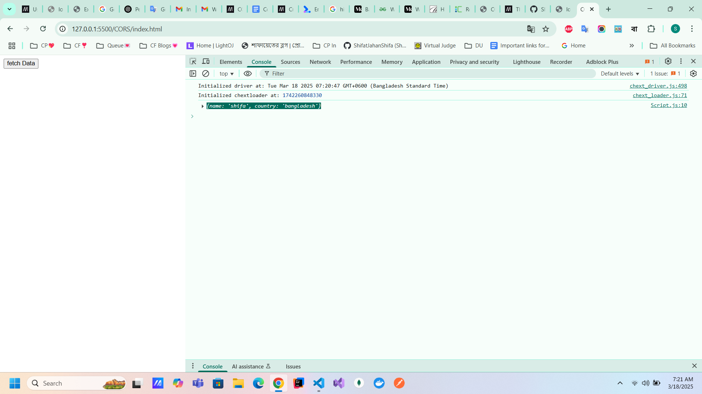
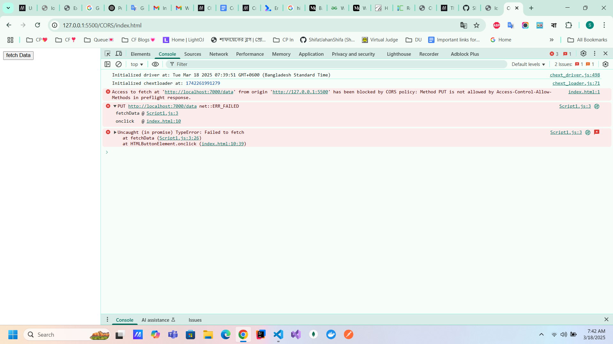

# CORS- Cross Origin Resource Sharing

`SOP` means same origin policy. It does not prevent writing between web application but reading between web application. The access is determined by `origin`. 

When the CORS errors occur, we see the status code is `200 ok`. Because the server successfully processed the request. Though our browser blocks the response due to cors policy. 

`Step-1:` when no cors i specified in the server. 
  

the net::ERR_FAILED means the browser fails to process the response. 

`Step-2:` when cors is used with the particular origin

`Step-3:` use `*` to allow all origins

preflight requests occur when we dont use simple methods like `GET`,`HEAD`,`POST`. 

`step-4`: we can set in the cors middleware in express server which methods are allowed. 

`step-5`: request with header

## Cors headers
1. Access-Control-Allow-Credentials: `true`
2. Access-Control-Allow-Origin: 
3. Access-Control-Allow-Methods: 