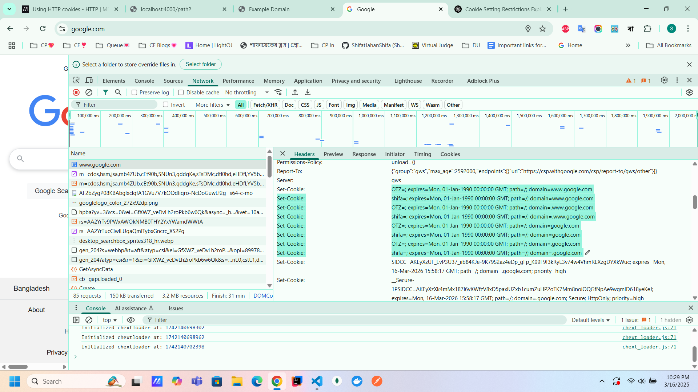
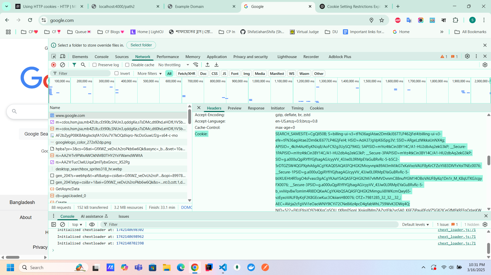

# Cookie🍪 

Those who are public domains and  don't let third party javascript code to set cookie on their domain, they will response with a `Set-Cookie` header valued the same we set using javascript code with expiry dated in the past. That forcefully delete the cookie. 

  

Also I have a querstion in my mind. Like why we store information using cookie and why there are so many cookie associated with a site. I got my answer from chatgpt.   

Websites can use multiple cookies for a site for different purposes.   
1. Authentication and session management:   
    - `SID`, `SAPISID`, `SSID`
2. Security and Fraud Prevention: 
    - `SEARCH_SAMESITE`, `SIDCC`
    - prevent CSRF attack and unauthorized access
3. User Preferences and customization
    - `NID`,`UULE`
    - Stores language preferences, location settings, and personalized search results.
4. Analytics & Performance Tracking
    - Example: OTZ, DV
    - Helps track user interactions and improve website performance.
5. Cross-Device & Multi-Account Support
    - Example: ACCOUNT_CHOOSER, G_AUTHUSER_H
    - Allows switching between multiple accounts and synchronizing preferences across devices.
6. Third-Party Services & Ads
    - Example: 1P_JAR, ANID
    - Used for ad personalization, tracking conversions, and remarketing.
7. Session vs. Persistent Cookies
    - Some cookies expire when you close your browser (session cookies), while others persist across sessions (persistent cookies) to remember preferences.

A database can store information like language preferences, authentication data, and tracking details, but using cookies has several advantages:

1. Speed & Efficiency
✅ Cookies store data locally on the user’s device, reducing the need to query the database for every page load.
❌ Database requests require a network call, adding latency and increasing server load.

    👉 Example: If language preference is stored in a cookie, the browser can instantly apply it without waiting for a server response.

2. Reduced Server Load
✅ If basic preferences (like language, theme, or login session) are stored in a cookie, it reduces the number of database queries, making the website more scalable.
❌ If every user action required a database lookup, the server would become overloaded quickly.

    👉 Example: Google Search can immediately recognize your preferred language via a cookie instead of querying a database each time.

3. Statelessness & Load Balancing
✅ Cookies allow servers to be stateless—when a user moves between different servers (like in a load-balanced system), the necessary information is already in their browser.
❌ If all user data was stored in a database, every request would need a lookup, making multi-server setups more complex.

    👉 Example: If Google’s servers had to check a database for every search request, their response time would slow down significantly.

4. Offline Access & Persistence
✅ Cookies work even when offline, allowing websites to remember some settings without a constant connection.
❌ Databases require a server connection, making offline functionality difficult.

    👉 Example: Some sites remember dark mode settings using cookies, even when offline.

5. Privacy & Security (Sometimes)
✅ Users can clear cookies at any time, giving them control over stored data.
❌ If preferences were always stored in a database, users might not have direct control.

    👉 Example: Users can delete cookies to reset language or session data without needing to contact support.

When to Use a Database Instead of Cookies?   
- Sensitive data (passwords, personal details) → should be in a secure database.
- Large datasets (user history, analytics) → too big for cookies, better stored in a database.
- Data consistency (profile settings) → cookies can be modified by users, making them unreliable for storing critical info.
#### Conclusion
Cookies provide fast, lightweight, and client-side storage for user preferences, reducing database load and improving performance. However, critical or sensitive data should always be stored in a database for security and consistency. 

## creating cookie
1. we can create cookie using javascript code in the client side.
2. server side cookie using `Set-Cookie` header. 
   
## property of cookie
1. domain, subdomain
2. path 
3. max-age, expire [document.cookie="tempcookie=2; max-age=180"] 
4. same site (strict, lax, none)
   
## cookie types
1. Session cookie
2. permanent ""
3. httpOnly ""
4. secure ""
5. Third party ""
6. Zombie ""
   
## Cookie security
1. stealing cookie
2. csrf