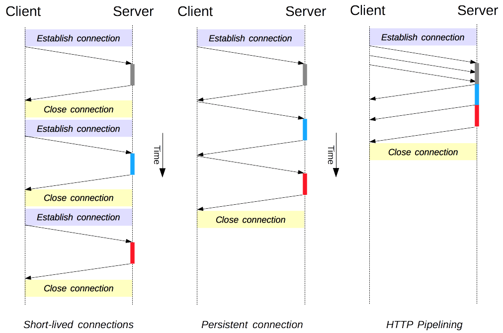

# Connection Management in HTTP/1.X 

In HTTP/1.X, there are several connection models. Such as- Short-lived connection(HTTP/1.0), persistent connection(HTTP/1.1), HTTP pipelining(HTTP/1.1). 



> Know more      

The connection in HTTP is actually `hop-by-hop`. The connection model can vary among different hop-by-hop connections. 

## Short-lived connection
It is default in HTTP/1.0. For each request, we initiate a TCP connection. When the response is served, the connection is closed. 
```HTTP
Connection: close
``` 
>If we use anything other than `close`, like `retry-after`, it will make the connection persistent.   

### Disadvantages
It consumes more time to satisfy all requests of a client as it initiates TCP connection each time a request is made. 

## Persistent Connection 
We can make subsequent requests to a server using the same TCP connection. Thus we can save the time to establish TCP connection each time. 
```HTTP
Connection: keep-alive
``` 
However, the connection will not be kept open forever. After some time, the idle connection is closed. We can specify the time by using `keep-Alive` header.  
The browser can request to server by opening several parallel connections numbering upto 6. 


### Disadvantages
1. while idling, they consume resources. 
2. under heavy load, `DoS` attack can be conducted. 

## Pipelining
We can make a second request without waiting for the answer of the first request. Thus it reduces the latency. It is not activated by default by modern browsers. It is complex to implement. 
> it is superseded by *multiplexing* algorithm in HTTP/2.0.   

> Only the HTTP request of idempotent methods, can be pipelined. If failure occurs, we can replay safely. 


## Domain Sharding 
Without urgent specific need, we should not use this technique as it is depricated now.    
We can split a domain into multiple domains residing in a single server. 


