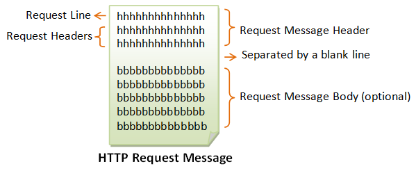
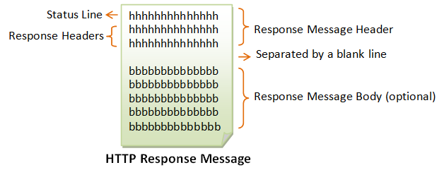
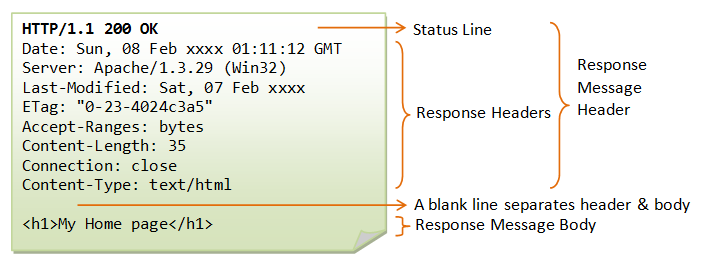

# HTTP request and response message

> There is a blank line between header and body of message. 

`request message`   




Example of request line: 

```HTTP
GET /test.html HTTP/1.1
HEAD /query.html HTTP/1.0
POST /index.html HTTP/1.1
``` 

Headers appear in the form of key:value pairs. Multivalues are separated by comma. 

Example: 

```HTTP
Host: www.xyz.com
Connection: Keep-Alive
Accept: image/gif, image/jpeg, */*
Accept-Language: us-en, fr, cn
``` 

> The query string parameters can be seen in the URL of a **GET** request but it is seen in the body section of a **GET** request as a payload. 


`response message` 




Examples of status line are:

```HTTP
HTTP/1.1 200 OK
HTTP/1.0 404 Not Found
HTTP/1.1 403 Forbidden
``` 

Examples of response headers are:

```HTTP
Content-Type: text/html
Content-Length: 35
Connection: Keep-Alive
Keep-Alive: timeout=15, max=100
``` 

Example of Body: 



In the body part, the hypertext document has been passed. 


