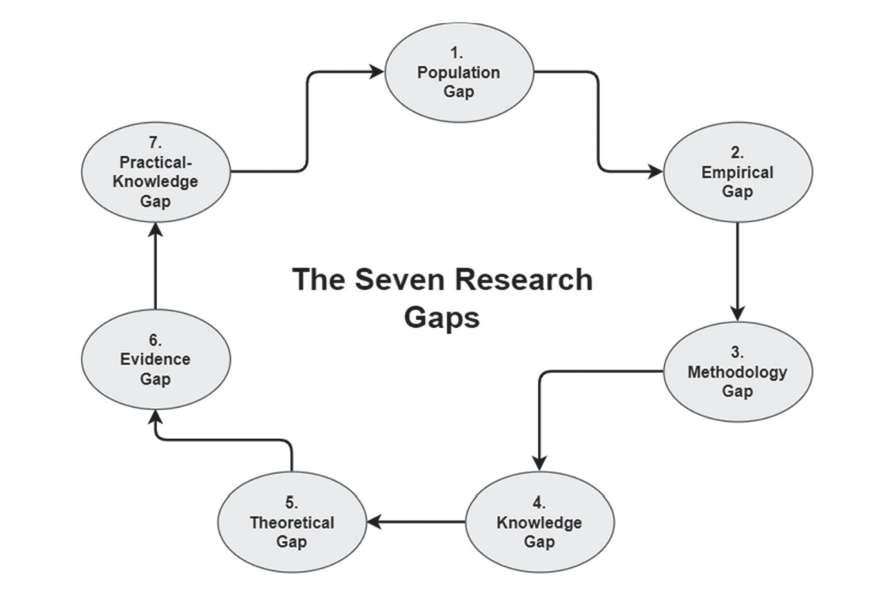

There are seven types of research gaps. Below is the description of each from the most common types to the least common types. 

<figure align='center'>
    

      
    

    <figcaption><i>Fig: The seven types of research gap from the most common to the least common</i></figcaption>
</figure>

<code>1. Population Gap</code> 
This gap focuses on a population that is under-researched or not adequately represented in prior research (e.g., gender, race/ethnicity, age, etc). A population gap is the most common gap recognized by researchers.    

    
The key characteristics: 

    <li>It is a very common research gap
    <li>It addresses the population which is under-researched or not adequately represented in the prior research work or evidence base. 

  

  
<code>2. Empirical Gap</code> 
This gap is concerned with research findings in prior research that lack empirical research or a subject matter that needs to be evaluated or empirically verified. An empirical gap deals with gaps in prior research. This conflict deals with the research findings or propositions that need to be evaluated or empirically verified.                

       

    
The key characteristics: 

    <li>An empirical gap is the second most common gap recognized by researchers.
    <li>This gap deals with the research findings or propositions that need to be evaluated or empirically verified.
    <li>The empirical gap often addresses conflicts that no study to date has directly attempted to evaluate a subject or topic using an empirical approach.

  

  
<code>3. Methodological Gap</code> 
This gap is the type of gap that deals with the lack of variation in research methods in prior research that could use a different line of inquiry. A methodological gap is the type of gap that deals with the conflict that occurs due to the influence of methodology on research results.
 
  

    
The key characteristics: 

    <li>A methodological gap is the third most common gap recognized by researchers.
    <li>This gap addresses the conflicts with research methods in prior studies and offers a new line of research that is divergent from those research methods.
    <li>A variation in research methods is necessary to generate new insights or to avoid distorted findings.
    <li>For the researcher, it might be useful to vary research methods, especially if certain research topics have been mainly explored using a singular or common research methodology.

  

  
<code>4. Knowledge Gap</code> 
This gap is concerned with the lack of research on a particular subject. Thus the desired research findings do not exist. The knowledge gap is a common gap in prior research.
 
  

    
The key characteristics: 

    <li>The knowledge gap is the fourth most common gap in prior research.
    <li>There are two situations where a knowledge gap (knowledge void) might occur:        

<b>1. Knowledge may not exist</b>: Knowledge may not exist in the actual field compared to theories and prior literature from related research domains.   
<b>2. Differing results</b> It might be the case that the results of a study differ from what was expected.

  

  
<code>5. Theoretical Gap</code> 
This gap is concerned with a lack of theory on or conceptual / theoretical models for a particular subject matter in prior research.  Because there is a lack of theory, a gap exists. The theoretical gap deals with gaps in the theory in prior research.
 
  

    
The key characteristics: 

    <li> The theoretical gap is the fifth most common gap in prior research.
    <li> For example, if one phenomenon is being explained through various theoretical models, then, similar to a methodological conflict, there might be a theoretical conflict.
    <li> Researchers and scholars could examine the existing theories to find out any limitation or conflicts.
    <li> Theoretical gaps are a common occurrence when examining prior research on a phenomenon. We may find inconsistencies or weak theories.

  

  
<code>6. Evidence Gap</code> 
This gap is concerned with contradictions in the findings of prior research. There are conflicts in prior studies that have contradictory results and conclusions.
 
  

    
The key characteristics: 

    <li> An evidence gap is somewhat common compared to its counterparts. However, it is recognized by researchers and does exist in prior research.
    <li> An evidence gap occurs when a provocative exception arises, when new research finding contradicts widely accepted conclusions.
    <li>  This occurs if results from studies allow for conclusions in their own right but these results are contradictory when examined from a more abstract point of view. 
    <li> The identification of contradictory evidence starts with analyzing each research stream. The results from these analyses need to be synthesized in order to reveal contradictory evidence.

  
<code>7. Practical-Knowledge Gap</code> 
This gap is concerned with professional behavior or practices that deviate from
research findings or are not covered by research.
 
  

    
The key characteristics: 

    <li> A practical-knowledge gap is not a common gap compared to its counterparts. However, it is recognized by researchers and does exist in prior research.
    <li> An evidence gap occurs when a provocative exception arises, when new research finding contradicts widely accepted conclusions.
    <li>  A practical-knowledge (action-knowledge) conflict arises when the actual behavior of professionals is different from their advocated behavior. 
    <li> In this case, research could seek to determine the scope of the conflict and to uncover the reasons for its existence.

